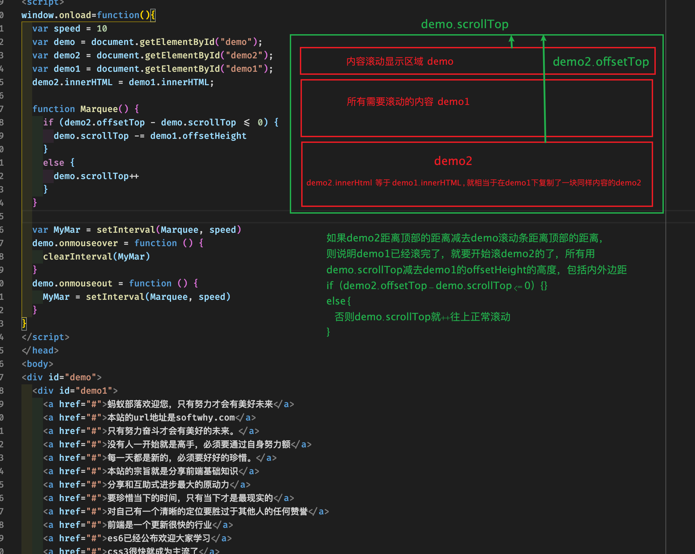

####js 无缝滚动效果

```
<!DOCTYPE html>
<html>
<head>
<meta charset=" utf-8">
<meta name="author" content="http://www.softwhy.com/" />
<title>蚂蚁部落</title>
<style type=text/css>
#demo {
  overflow:hidden;
  height:32px;
  width:350px;
  border:1px solid #dde5bc;
}
#demo a {
  width: 100%;
  overflow: hidden;
  font: 12px/16px tahoma;
  display: block;
  text-decoration: none;
  margin: 2px;
  color: #4a551c;
  padding-left: 2px;
  text-align: left;
}
#demo a:hover {
  color: #ff6600;
}
</style>
<script>
window.onload=function(){
  var speed = 10
  var demo = document.getElementById("demo");
  var demo2 = document.getElementById("demo2");
  var demo1 = document.getElementById("demo1");
  demo2.innerHTML = demo1.innerHTML;

  function Marquee() {
    if (demo2.offsetTop - demo.scrollTop <= 0) {
      demo.scrollTop -= demo1.offsetHeight
    }
    else {
      demo.scrollTop++
    }
  }

  var MyMar = setInterval(Marquee, speed)
  demo.onmouseover = function () {
    clearInterval(MyMar)
  }
  demo.onmouseout = function () {
    MyMar = setInterval(Marquee, speed)
  }
}
</script>
</head>
<body>
<div id="demo">
  <div id="demo1">
    <a href="#">蚂蚁部落欢迎您，只有努力才会有美好未来</a>
    <a href="#">本站的url地址是softwhy.com</a>
    <a href="#">只有努力奋斗才会有美好的未来。</a>
    <a href="#">没有人一开始就是高手，必须要通过自身努力额</a>
    <a href="#">每一天都是新的，必须要好好的珍惜。</a>
    <a href="#">本站的宗旨就是分享前端基础知识</a>
    <a href="#">分享和互助式进步最大的原动力</a>
    <a href="#">要珍惜当下的时间，只有当下才是最现实的</a>
    <a href="#">对自己有一个清晰的定位要胜过于其他人的任何赞誉</a>
    <a href="#">前端是一个更新很快的行业</a>
    <a href="#">es6已经公布欢迎大家学习</a>
    <a href="#">css3很快就成为主流了</a>
  </div>
  <div id="demo2"></div>
</div>
</body>
</html>

```


