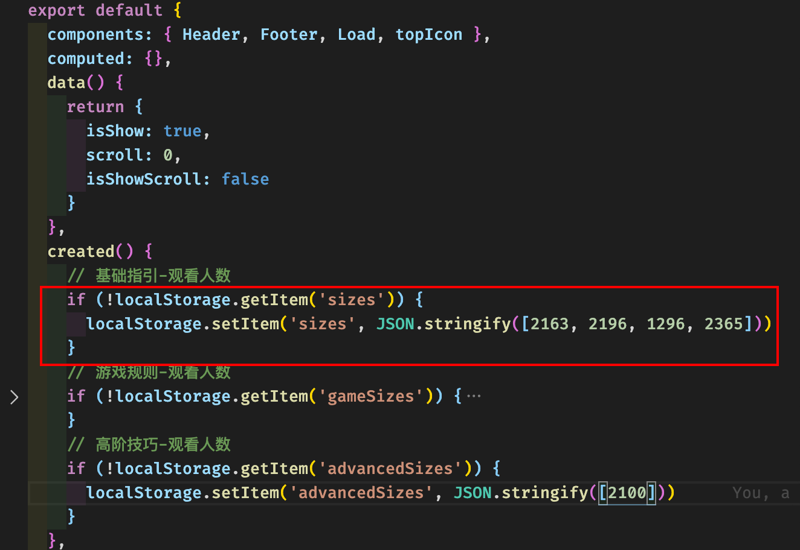
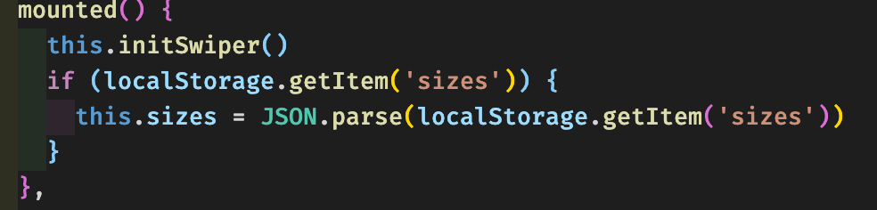
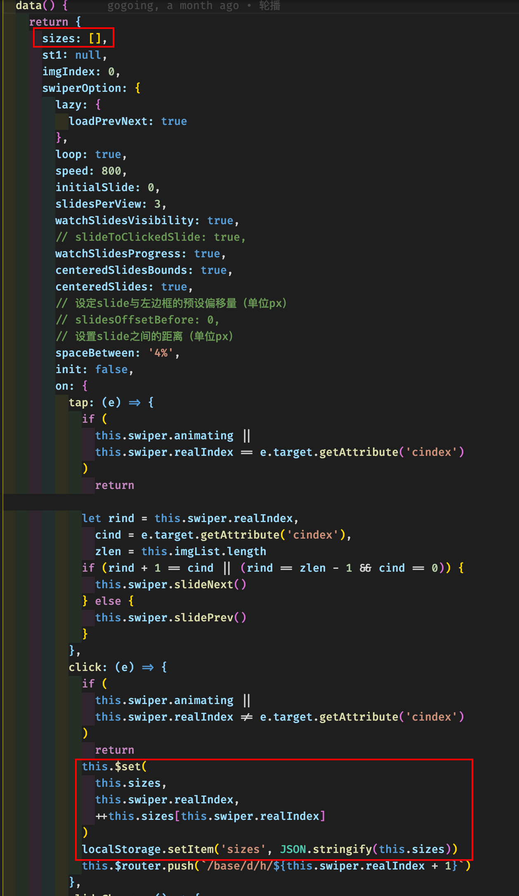

#####通过 localStorage 实现每次点击查看详情界面，小眼睛观看人数+1

1. layout.vue 文件中把‘观看人数’存储在 localStore 中， 因为 layout.vue 是<router-view></router-view>入口文件
2. 为了避免重复创建多个 localStore 变量，需要判断下 localStore 中是否存在该变量，没有再通过 setItem 创建
3. localStore.setItem()存储数组的时候， 需要用 <b>JSON.stringify</b> 转成字符串存储

 
1. 点击详情跳转的逻辑页面中，生命周期函数中判断 localStorage 是否存在对应的变量，若存在
   
   
   #FF7F50
